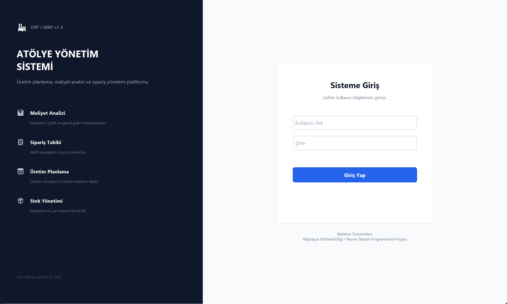
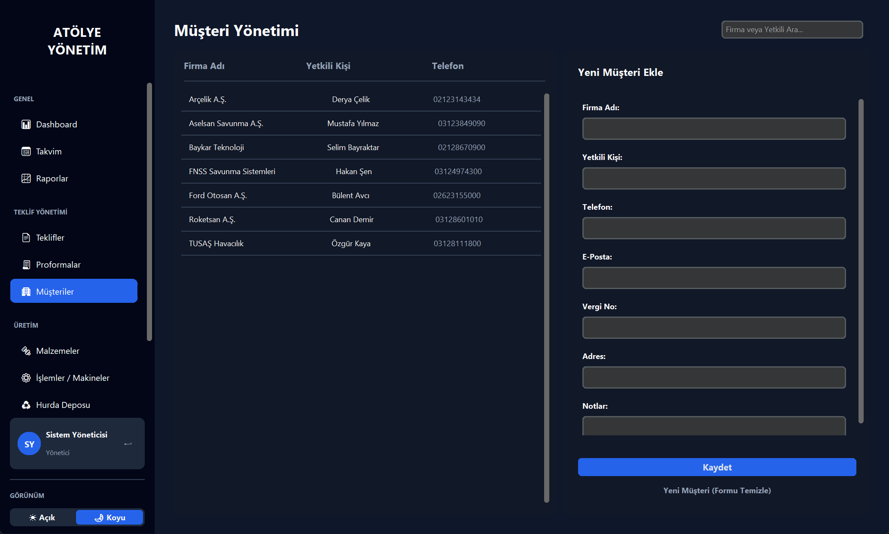
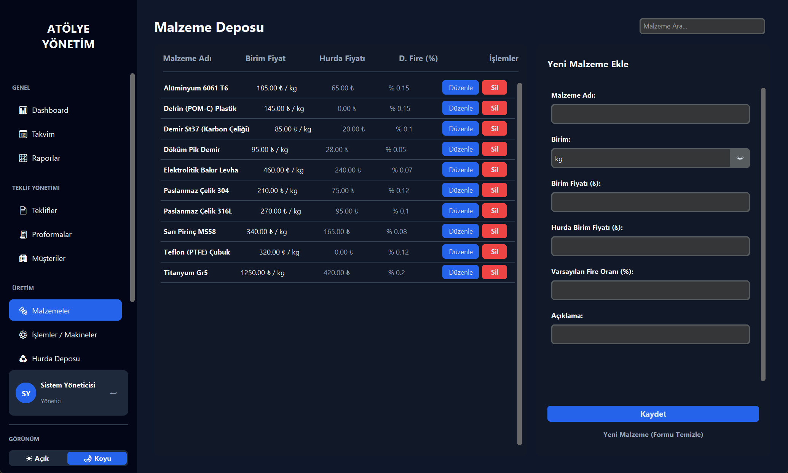
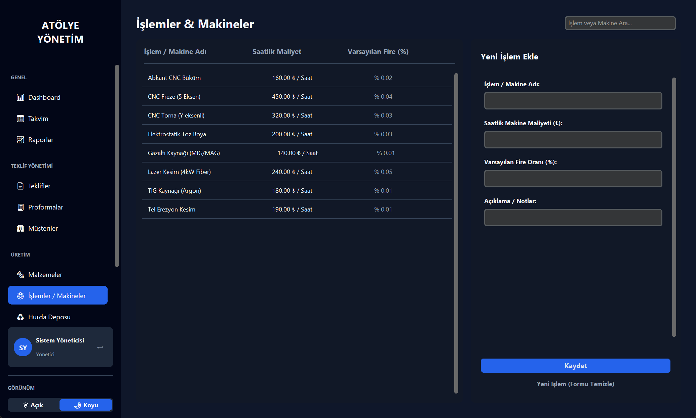
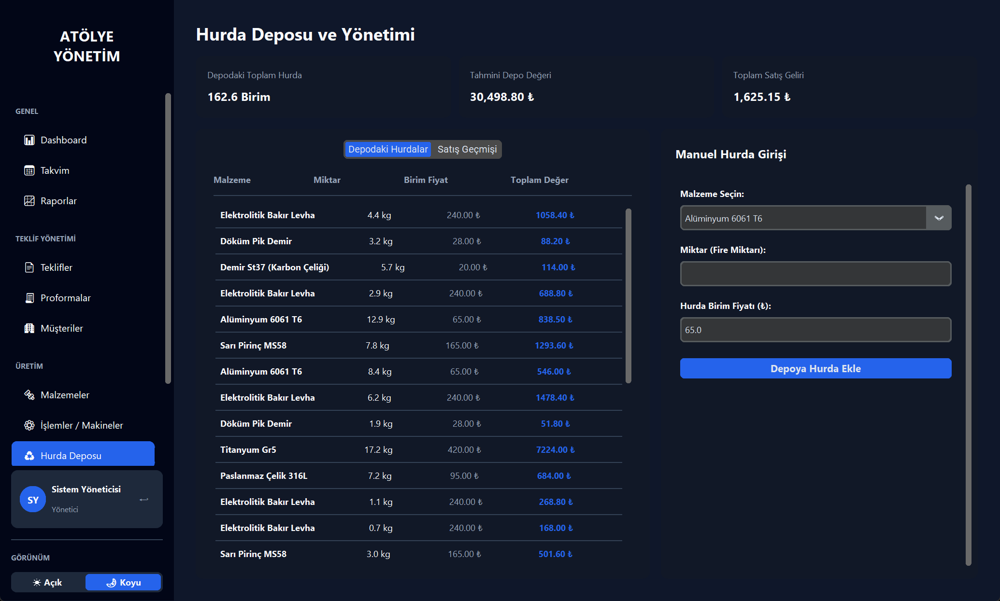
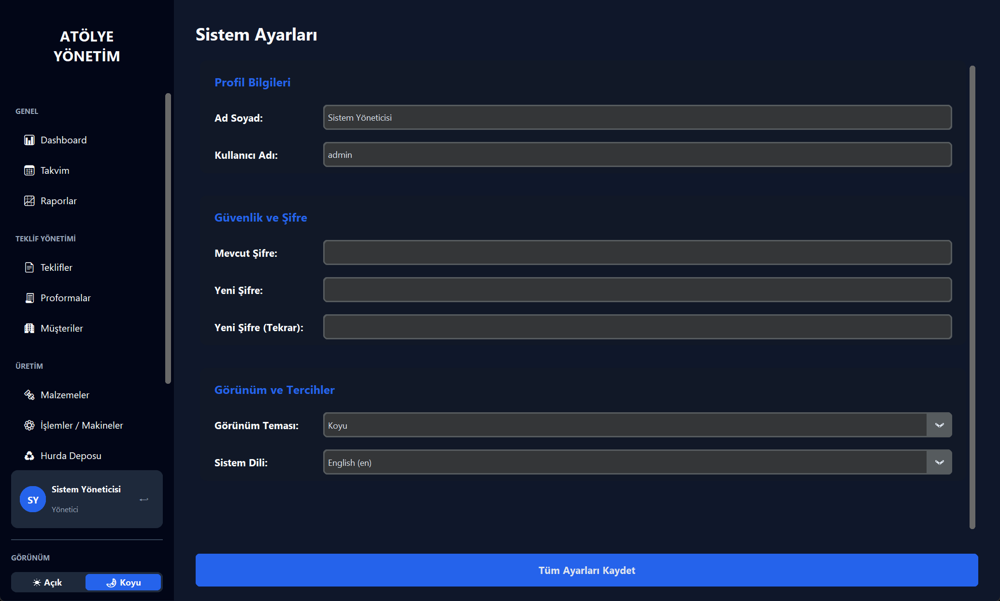
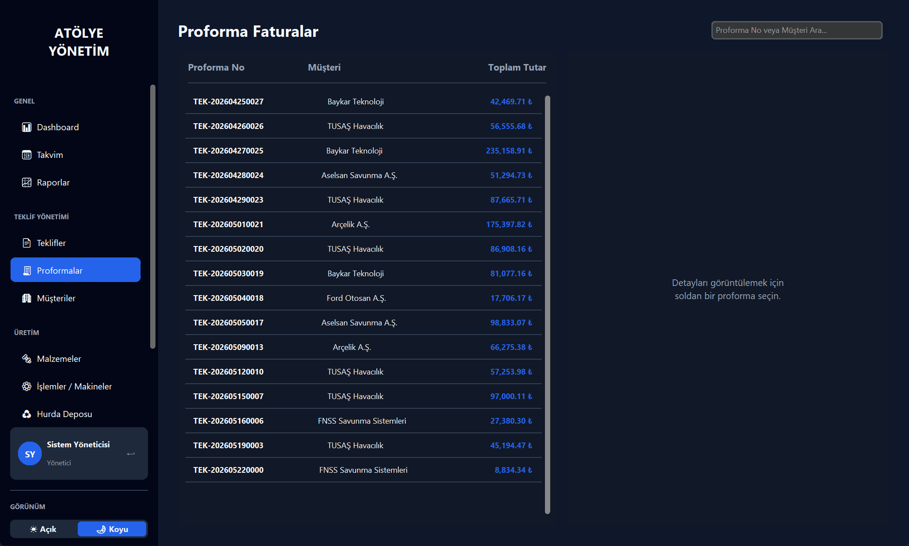

# 🔧 Smart Manufacturing Manager (Akıllı Atölye ve Üretim Yönetim Sistemi)

> **Modern, Premium ve Veri Odaklı Atölye Yönetim Platformu**  
> CustomTkinter ile geliştirilmiş, ultra-modern arayüze sahip, çift tema destekli (Açık/Koyu), veri izolasyonlu ve kapsamlı finans/takvim modülleri içeren yeni nesil üretim yönetim ve maliyet hesaplama yazılımı.

---

## 📸 Ekran Görüntüleri (Screenshots)

### 🔐 1. Kurumsal Giriş Ekranı (Sisteme Giriş)
Üniversite sunum standartlarına uygun, sade, güvenli ve kurumsal split-panel giriş ekranı. (Kullanıcı doğrulanırken dinamik yükleme animasyonu içerir).
* **Açık Tema Giriş Ekranı:**

* **Koyu Tema Giriş Ekranı:**


### 📊 2. Panel Özeti (Dashboard - Çift Tema Desteği)
Atölyenizin gerçek zamanlı durumunu, ciro dağılımlarını, aktif siparişleri ve hurda depo değerlerini tek ekrandan izleyin. Matplotlib grafikleri seçilen temayla dinamik olarak uyum sağlar.
* **Koyu Tema Görünümü:**

* **Açık Tema Görünümü:**


### 📋 3. Teklif Yönetimi & Hızlı Teklif Sihirbazı
Detaylı maliyet hesaplama motoru ile dakikalar içinde malzeme, makine ve ek giderleri hesaplayıp teklif oluşturun.


### 📅 4. Akıllı Üretim Takvimi
Termin tarihlerini, teslimatları ve makine iş yüklerini takvim üzerinden sürükle-bırak hassasiyetinde yönetin.


### 📈 5. Raporlama ve Gelişmiş Grafikler
Dönemsel ciro, brüt kar marjı, malzeme giderleri ve en çok kullanılan üretim metotlarını analiz edin.


### 👥 6. Müşteri & Malzeme & İşlem Yönetimi
Müşteri portföyünüzü, güncel sac/profil malzeme fiyatlarını ve saatlik makine maliyetlerini dinamik olarak yönetin.




### ♻️ 7. Hurda Deposu & Geri Dönüşüm
Üretimden kalan fire oranlarını ve hurdaların finansal değerlerini takip ederek hammadde verimliliğini artırın.


### ⚙️ 8. Ayarlar ve Tema Yönetimi
Kullanıcı bazlı arayüz modunu (Açık/Koyu) tek tuşla değiştirin ve kurumsal bilgilerinizi özelleştirin.



---

## ✨ Öne Çıkan Özellikler

* 🎨 **Premium Arayüz Deneyimi:** CustomTkinter ile oluşturulmuş, sistem veya kullanıcı tercihlerine duyarlı, akıcı Açık/Koyu tema desteği.
* 📈 **Gerçek Zamanlı KPI & Ciro Hesaplama:** Yalnızca onaylanmış işleri mali performansa dahil eden akıllı raporlama mantığı.
* 📅 **Gelişmiş Takvim Modülü:** Teslimat ve termin tarihlerinin durum koduna göre renklendirilmiş interaktif takvim görünümü.
* ♻️ **Hurda Yönetim Döngüsü:** Atölye içi fire malzemelerinin stok takibi ve geri kazanım potansiyelinin hesaplanması.
* 📂 **Proforma & PDF Raporlama:** Faturalandırma süreçleri için proforma yönetimi ve PDF rapor çıktısı alma.

---

## 🚀 Başlangıç ve Kurulum

### Bağımlılıklar
Uygulama çalıştırılmadan önce Python 3.10+ ve aşağıdaki kütüphanelerin yüklü olduğundan emin olun:
```bash
pip install customtkinter matplotlib pillow sqlite3
```

### Çalıştırma
Projeyi klonladıktan sonra ana dizinde terminalden şu komutu çalıştırarak uygulamayı başlatabilirsiniz:
```bash
python main.py
```

* **Varsayılan Yönetici Giriş Bilgileri:**
  * **Kullanıcı Adı:** `admin`
  * **Şifre:** `1234`

---

## 🛠️ Teknik Altyapı
* **GUI Framework:** CustomTkinter (Python)
* **Veritabanı:** SQLite (`data/app.db`)
* **Veri Görselleştirme:** Matplotlib (Dinamik tema uyumlu donat ve çizgi grafikler)
