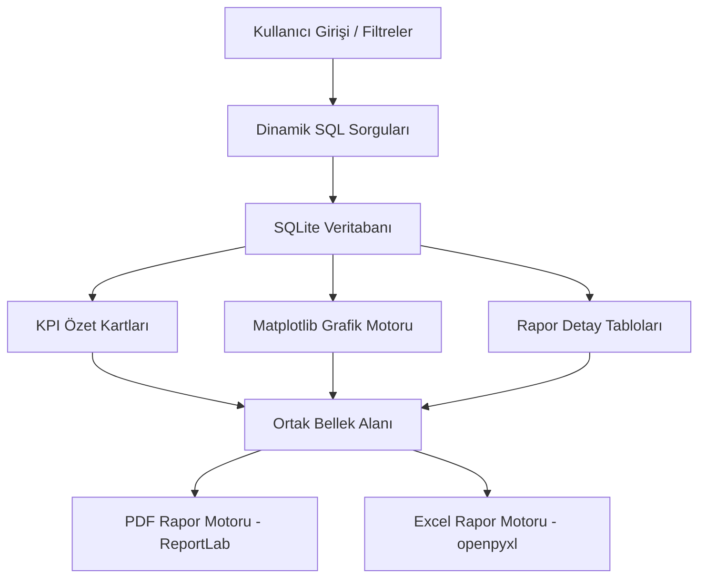
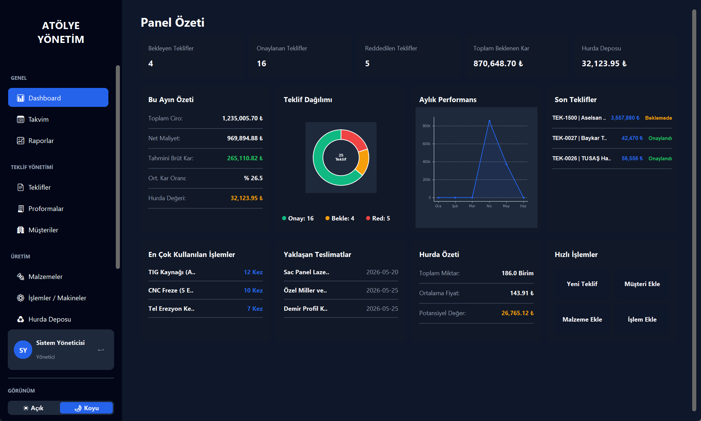
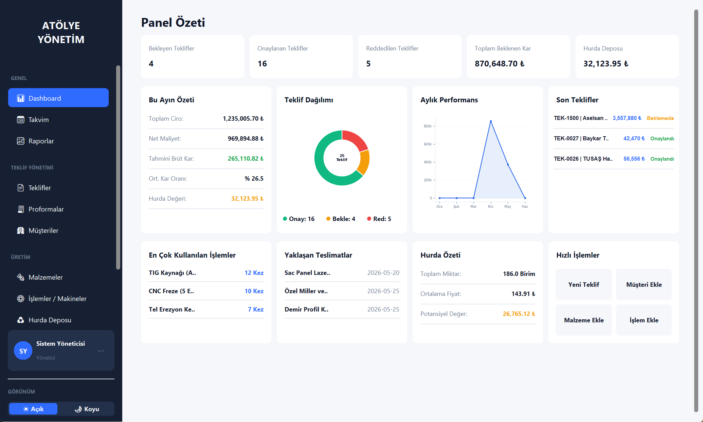
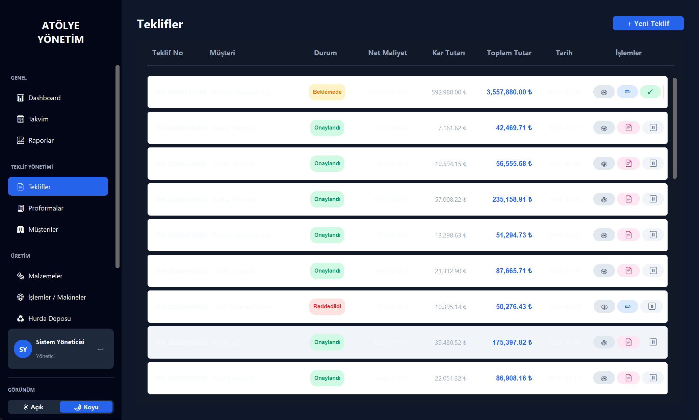
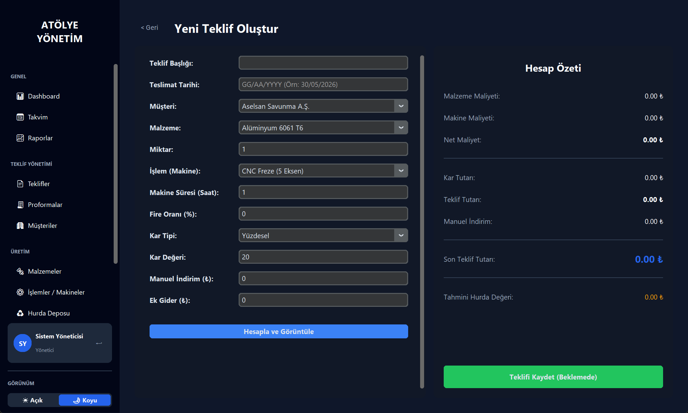
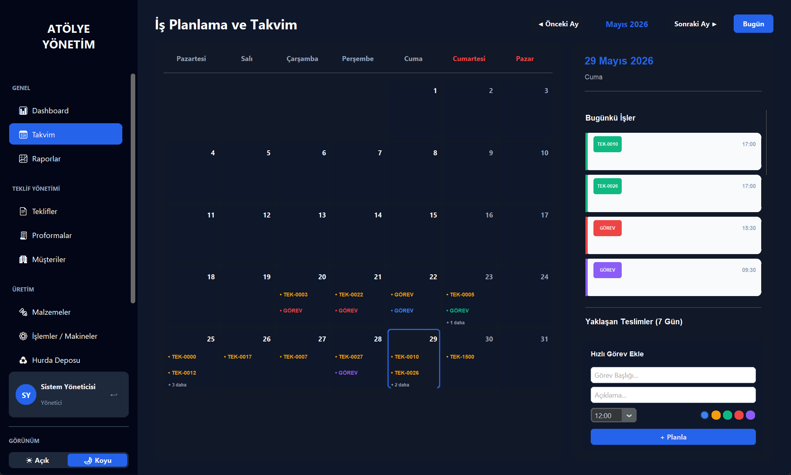
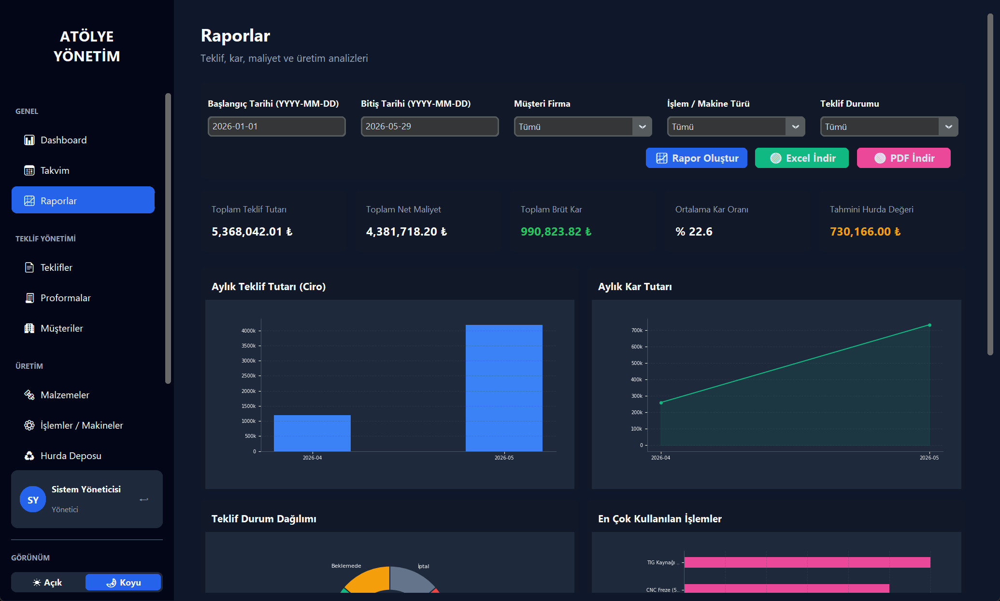

<div align="center">
  
  <h1 align="center">Smart Manufacturing Manager</h1>
  <p align="center">
    Atölye Süreçleri için Akıllı Maliyet Hesaplama, Geri Kazanım ve Kar Takip ERP Platformu
    <br />
    <a href="https://github.com/oguzaliozel/smart-manufacturing-manager"><strong>Repo Sayfası</strong></a>
    ·
    <a href="mailto:oguzaliozel@gmail.com"><strong>İletişim</strong></a>
  </p>
</div>

---

### 📌 Proje Hakkında (About The Project)

**Smart Manufacturing Manager**, imalat süreçlerindeki malzeme, makine ve operasyonel maliyetleri hesaplamanın ötesine geçerek; üretimdeki fire oranlarını ve hurda değerlerini analiz eden, atölyede kalacak gizli kazancı (hurda kârı) ortaya çıkararak teklifleri en kârlı şekilde sunmanızı sağlayan modern bir masaüstü yazılımıdır. 

Bu proje, bir atölyenin teklif hazırlamaktan üretime, sevkiyat takibinden dönemsel raporlamaya kadar olan tüm iş akışını tek bir merkezden yönetir.

---

### 🚀 Öne Çıkan Özellikler (Core Features)

*   🎨 **Çift Tema Desteği & Dinamik GUI:** Sistem veya kullanıcı ayarlarına göre anlık Açık/Koyu mod geçişi. CustomTkinter tabanlı modern ve kurumsal arayüz.
*   💱 **Asenkron Kur Takibi (TCMB API):** Arayüzü dondurmayan asenkron thread mimarisi ile canlı USD/EUR kur takibi ve internet kesintilerinde çevrimdışı hata yönetimi (`Graceful Degradation`).
*   📈 **Dinamik Grafik Analizleri:** Temayla uyumlu, Matplotlib tabanlı donut (durum dağılımı) ve çizgi (ciro/kar takibi) grafik panelleri.
*   📄 **Profesyonel PDF & Excel Aktarımı:** Türkçe karakter destekli PDF (ReportLab) dökümleri ve çok sekmeli muhasebe formatlı Excel (openpyxl) raporlama modülleri.
*   🔐 **Güvenli Kimlik Doğrulama:** Kullanıcı şifrelerinin veritabanında **SHA-256** hash özetleriyle saklanması ve JSON tabanlı yerel tercih yöneticisi.

---

### 📊 Sistem Mimarisi & Veri Akışı (Architecture & Data Flow)

Uygulama, veritabanından çekilen dinamik verileri eş zamanlı olarak arayüz bileşenlerine ve dışa aktarım motorlarına dağıtan modüler bir veri akışına sahiptir.



#### 🗄️ Veritabanı İlişkileri (Database Schema)
*   **Teklif ve Kalem İlişkisi:** `teklifler` ve `teklif_kalemleri` tabloları arasında **Bire-Çok (1-to-Many)** ilişki kurgulanmıştır.
*   **Veri Tutarlılığı:** Yabancı anahtar kısıtları (`FOREIGN KEY`) ve `ON DELETE CASCADE` tetikleyicisi sayesinde bir teklif silindiğinde ona ait tüm malzeme ve işlem kayıtları otomatik olarak temizlenir.

---

### 📸 Ekran Görüntüleri (Screenshots)

#### 🔐 Giriş Paneli (Login Screen)
*Gelişmiş split-panel arayüzü, şifreli kimlik doğrulama ve kullanıcı tercihleri (JSON).*


#### 📊 Panel Özeti (Dashboard)
*Gerçek zamanlı KPI kartları, asenkron TCMB döviz widget'ı ve dinamik grafikler.*
*   **Koyu Tema (Dark Mode):**
    
*   **Açık Tema (Light Mode):**
    

#### 📋 Teklif ve Maliyet Sihirbazı (Proposal Wizard)
*Malzeme, işçilik ve operasyonel giderlerin hesaplandığı otomatik teklif oluşturucu.*



#### 📅 Üretim Takvimi & Raporlama (Scheduler & Reporting)
*Termin tarihli takvim iş akışı ve çok boyutlu rapor analizleri.*



---

### 🚀 Kurulum ve Çalıştırma (Getting Started)

#### Gereksinimler (Prerequisites)
Projenin çalışması için Python 3.10+ sürümünün ve gerekli kütüphanelerin yüklü olması gerekir:
```bash
pip install customtkinter matplotlib pillow openpyxl reportlab
```

#### Çalıştırma (Execution)
Projeyi klonladıktan sonra ana dizinde terminalden şu komutla başlatabilirsiniz:
```bash
python main.py
```

*   **Varsayılan Giriş Bilgileri:**
    *   **Kullanıcı Adı:** `admin`
    *   **Şifre:** `1234`

---

### 🛡️ Lisans ve İletişim (License & Contact)

*   **Lisans:** MIT License
*   **Geliştirici:** Oğuz Ali Özel - [oguzaliozel@gmail.com](mailto:oguzaliozel@gmail.com)
